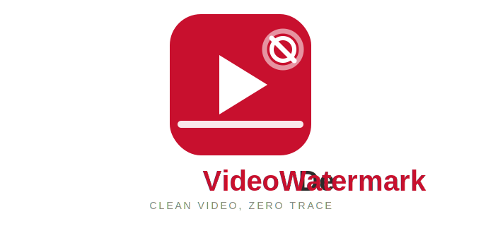
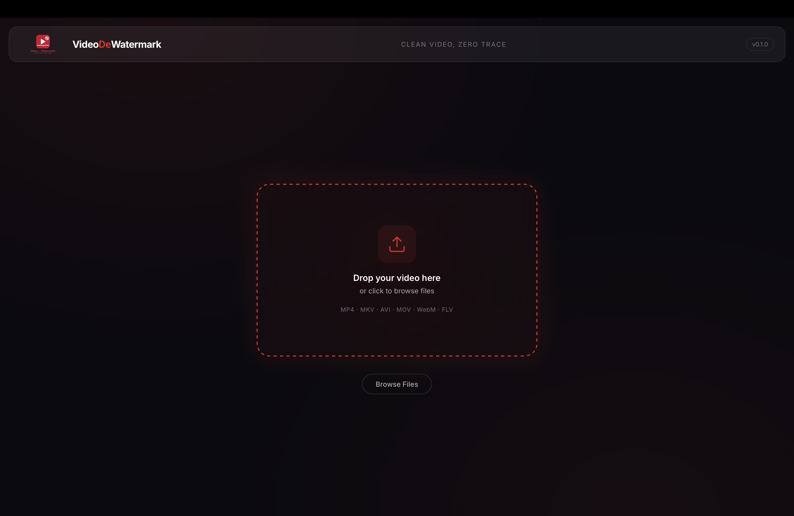
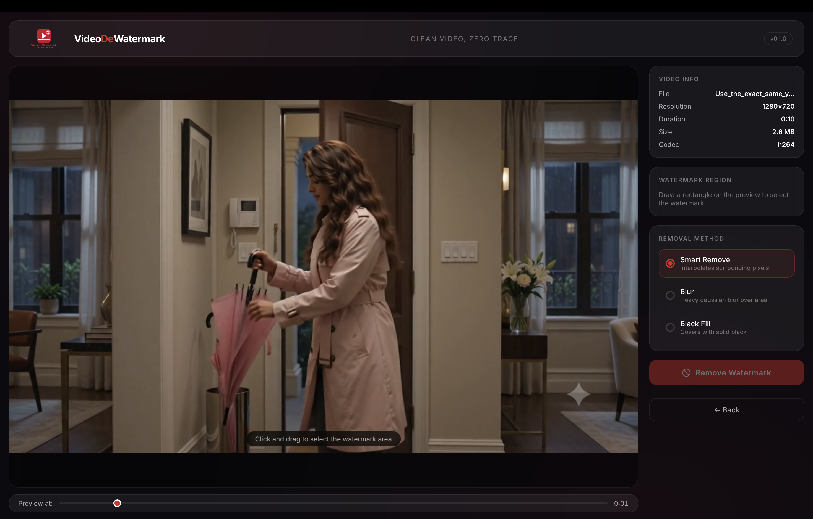
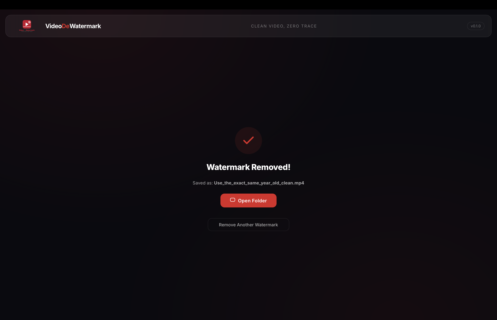

<div align="center">
  
  
  # 🎯 VideoDeWatermark
  **Clean Video. Zero Trace. Absolute Stealth.**
  
  [](https://tauri.app)
  [](https://rust-lang.org)
  [](https://ffmpeg.org)
  [](LICENSE)
</div>

<br/>


<div align="center">

## ☕ Support the Mission

If you find **VideoDeWatermark** useful, you can support the development:

<br/>

<a href="upi://pay?pa=860405059@ybl&pn=Anurag">
  
</a>

<br/><br/>

<sub>Support development via UPI: <b>860405059@ybl</b></sub>

</div>

---
> *"When a watermark compromises the mission, we bring in the heavy artillery. Scrub the frame, extract the intel, and leave no trace behind."*

**VideoDeWatermark** is a highly tactical, open-source desktop application engineered to eradicate watermarks from your video files. Operating strictly offline and powered by Tauri + FFmpeg, it runs silently behind enemy lines on your local machine to guarantee maximum privacy. 

---

## 📸 Field Recon (Screenshots)

*Drop your tactical screenshots (1.png, 2.png, 3.png) into the `docs` folder. The briefing will load them below.*

| Step 1: Secure the Package | Step 2: Acquire the Target | Step 3: Mission Accomplished |
|:---:|:---:|:---:|
|  |  |  |

---

## 🎖️ Arsenal & Capabilities

- **Cross-Platform Deployment:** Officially sanctioned for Windows, macOS, and Linux operatives.
- **Smart Eradication:** Employs advanced pixel interpolation (delogo) to scrub the target without leaving collateral damage.
- **Stealth Operation (Privacy First):** No cloud uploads. No radio transmissions. Everything executes securely in your local environment.
- **Automated Airdrops:** The system automatically parachutes the FFmpeg heavy artillery into your machine on first launch.
- **Tactical Selection UI:** Pinpoint the enemy watermark with a draggable, precision sniper scope.

---

## 🚁 Mission Briefing (Usage)

1. **Infiltrate:** Drag and drop the compromised video asset into the dropzone.
2. **Acquire Target:** Use the tactical overlay to draw a bounding box precisely over the watermark.
3. **Select Weapon:** Choose your eradication method (Smart Remove recommended).
4. **Execute:** Hit the **Remove Watermark** button and watch the progress radar as the target is eliminated.
5. **Extract:** Click **Open Folder** to retrieve your clean, untraceable video file.

---

## 🛠️ Boot Camp (Development)

Ready to enlist and build from source? You'll need the standard loadout: [Node.js](https://nodejs.org/) and [Rust](https://www.rust-lang.org/).

```bash
# Clone the repository
git clone https://github.com/DeveloperAnuragsrivastav/VideoDeWatermark.git
cd VideoDeWatermark

# Install tactical gear (dependencies)
npm install

# Run the live simulation (development mode)
npm run tauri dev

# Package the final payload (build for release)
npm run tauri build
```


---
## 🫡 Commanding Officer

<div align="center">
  <b>Anurag Srivastav</b><br/>
  <sub>Mission Architect & Lead Developer</sub>
  <br/><br/>
  
  [](https://www.linkedin.com/in/anurag-srivastav-717370326/)
 
</div>
<br/>

> *"Every operation needs a commander. This one's mine — built solo, tested in the field, deployed for anyone who needs to leave zero trace."*
---

## 📜 Standard Operating Procedure (License)

This software operates under the **MIT License**. See the `LICENSE` dossier for full details. 

*Note: This operation heavily relies on FFmpeg. The binary is automatically airdropped during your first run via public release channels.*
